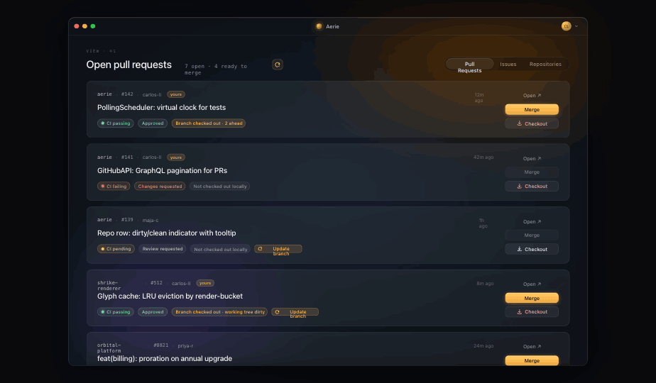
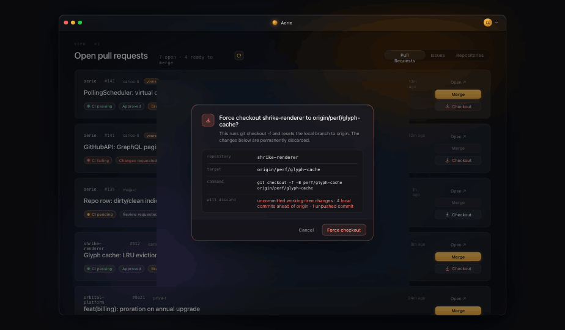
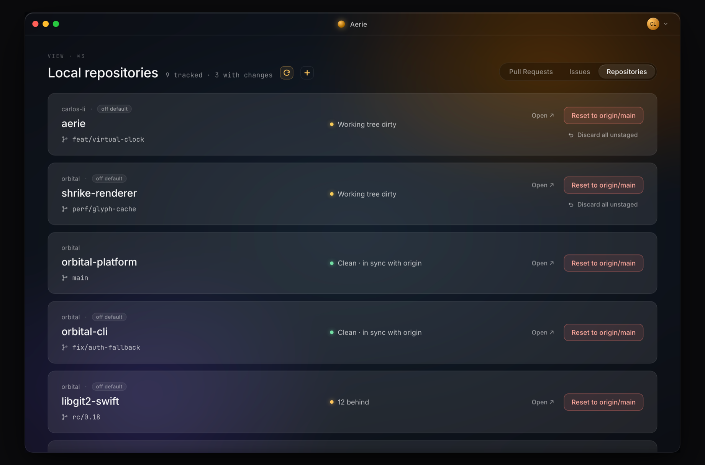

# Aerie

**A calm, dark-glass macOS client for triaging pull requests across many repositories.**
One amber accent, used only when something needs you.



Aerie watches the repos you actually work in and answers one question per row —
_is this PR ready, and is my local branch in sync for it?_ — without making you
leave the list, open a browser, or drop to a terminal.

> **Status:** early / personal project. Native SwiftUI, pure SwiftPM (no Xcode
> project), built and run from the `Makefile`.

---

## Download

Install (or update) with one command — downloads the latest release for your
Mac's architecture, replaces `/Applications/Aerie.app`, and launches it:

```sh
curl -fsSL https://raw.githubusercontent.com/echoulen/Aerie/main/install.sh | bash
```

It also strips the quarantine flag, so there's no Gatekeeper right-click dance.
Re-run the same command any time to update to the latest release.

Prefer to do it by hand? **[⬇ Download the latest Aerie for macOS (Apple Silicon)](https://github.com/echoulen/Aerie/releases/latest/download/Aerie-macOS-arm64.zip)**,
unzip, and move `Aerie.app` into `/Applications` (macOS 14+) — then right-click
`Aerie.app` → **Open** on first launch to get past Gatekeeper (the build is
self-signed, no Apple Developer account). You can also browse
[all releases and notes](https://github.com/echoulen/Aerie/releases/latest), or
[build from source](#build--run) instead.

## Features

### Pull requests
Each PR card shows the author, CI rollup, review decision, and the **local**
state of its branch (checked out? dirty? ahead/behind/unpushed?). Actions stack
down the right edge — **Open · Merge · Checkout**:

- **Merge** lights up only when GitHub would actually accept it. It follows
  GitHub's `mergeStateStatus`, and a failing CI rollup always holds it back.
- **Update branch** appears inline when your checkout has fallen behind its base,
  and merges `origin/<base>` in with one click.
- **Checkout** force-checks-out your local repo onto the PR's origin branch.

### Force checkout to a PR's branch

**Checkout** drops your local repo straight onto the PR's origin branch:

```sh
git fetch origin && git checkout -f -B <branch> origin/<branch>
```

When the working tree is dirty or the local branch has diverged the action is
destructive, so it's gated behind a confirmation that spells out exactly what
gets discarded. On a clean repo it's a calm amber "Check out" instead.



### Repositories
Track local clones and see each one's branch and working-tree state at a glance.
Per repo you can **Reset to origin/main**, **Discard all unstaged** changes
(including untracked files), reorder the list, and reassign the GitHub account it
uses. Adding a repo probes your connected accounts to bind the one that can
actually see it — so an org repo doesn't silently land on the wrong identity.



### Also in the app
- **Issues** tab — open issues across your repos, with assignee / label / comment
  context.
- **Multi-account** — works across several GitHub logins; each repo remembers
  which account it talks to.
- **MCP server** — an opt-in local endpoint that lets Claude Code read your
  fleet's status (git state, PRs) through a rotating token, with a consent
  prompt and an activity log.
- **Background polling** — refreshes on a cadence you control; the UI paints
  instantly from a local cache between ticks.

## Authentication

Aerie signs in through your existing [`gh`](https://cli.github.com) CLI login —
it reads tokens from `gh` at runtime and **does not store GitHub credentials of
its own**. If `gh` isn't installed or authenticated, the first-run screen walks
you through it.

## Requirements

- macOS 14 (Sonoma) or later
- [`gh`](https://cli.github.com) CLI, authenticated (`gh auth login`)
- A Swift toolchain (Swift 5.9+, e.g. from Xcode or the Command Line Tools)

## Build & run

Everything goes through the `Makefile`.

| Command | What it does |
|---------|--------------|
| `make dev` | Debug build, assemble a minimal `Aerie.app`, relaunch in place. **The default dev loop.** |
| `make run` | Release build, bundle, and launch `Aerie.app` from the repo. |
| `make install` | Release build, copy to `/Applications`, and zip to `dist/`. |
| `make test` | Run the test suite (`swift test`). |
| `make build` | `swift build -c release` — compile only. |
| `make clean` | Remove build artifacts. |

```sh
git clone <this-repo> && cd Aerie
make run
```

The first build creates a local self-signed signing certificate (`AerieDev`, no
Apple Developer account needed) so macOS permission grants persist across
rebuilds. There is no save-to-reload hot reload — each change needs a fresh
`make dev`.

## Architecture

Native **SwiftUI** on a **pure SwiftPM** package. A few notable pieces:

- **[GRDB](https://github.com/groue/GRDB.swift)** — a local SQLite cache of PRs,
  issues, and git status, so the UI is instant and works offline between polls.
- **[SwiftGitX](https://github.com/ibrahimcetin/SwiftGitX)** (libgit2) plus the
  `git` CLI — local repo state and the destructive git actions (reset, discard,
  force-checkout). The CLI is used for anything that needs your credentials /
  SSH config (fetch, push), which libgit2 can't reach.
- **GitHub GraphQL + REST** — PR/issue lists and merges, tried across your
  connected accounts.
- **[Hummingbird](https://github.com/hummingbird-project/hummingbird)** — the
  embedded HTTP server behind the MCP integration.

The design is recreated pixel-for-pixel from a [Claude Design](https://claude.ai/design)
handoff (a dark glass system with a single amber accent).

## License

[MIT](LICENSE) © 2026 echoulen
